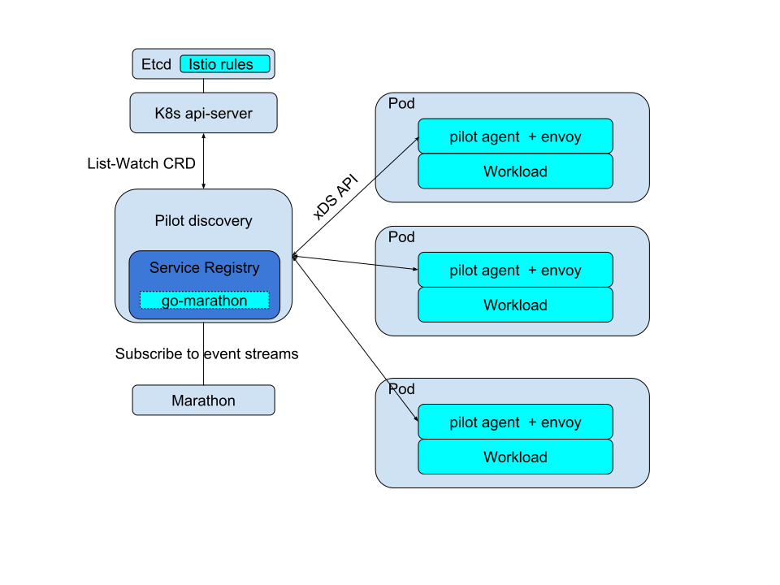
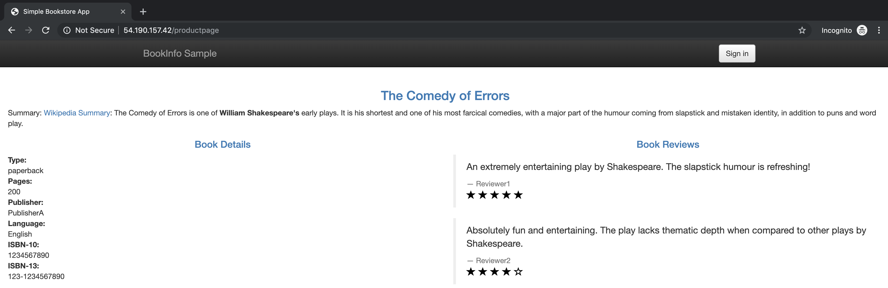
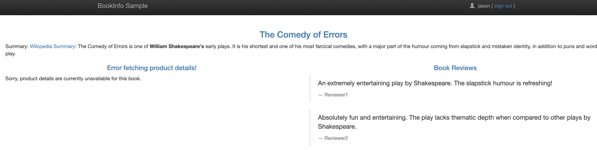
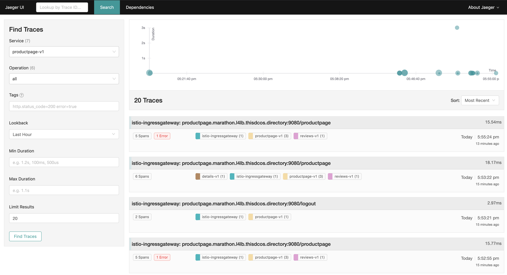

# Istio on Marathon + Mesos



This repo introduces how to run Istio on DC/OS or Mesos + Marathon environments. I added a new service registry based on Marathon's api to istio's pilot, using [go-marathon](https://github.com/gambol99/go-marathon) as a client. Istio's control-plane are running as Marathon applications, while workloads are running with a `envoy-proxy` container in the same Marathon Pod.

## Quick Start on DC/OS

### 1. Deploy the control-plane in DC/OS

The control-plane consists of `etcd, apiserver, istio-pilot and zipkin`. The apiserver is used only for providing [CustomResourceDefinitions](https://kubernetes.io/docs/concepts/extend-kubernetes/api-extension/custom-resources/#customresourcedefinitions) like `virtualservice`, `destinationrule`.

You can deploy the control-plane in group using command-line.
```
curl -XPOST master.mesos:8080/v2/groups -d "@install/istio-basic-control-plane.json"
```

### 2. Deploy the bookfinfo sample

The [bookinfo](https://istio.io/docs/examples/bookinfo/) is a sample application composed of four separate microservices used to demonstrate various Istio features.

```
dcos marathon pod add bookinfo/details.json
dcos marathon pod add bookinfo/ratings.json
dcos marathon pod add bookinfo/reviews-v1.json
dcos marathon pod add bookinfo/reviews-v2.json
dcos marathon pod add bookinfo/reviews-v3.json
dcos marathon pod add bookinfo/productpage.json
```
After the services are running, you should be able to access `productpage`:
```
curl productpage.marathon.l4lb.thisdcos.directory:9080
```

### 3. Deploy ingress-gateway

Now all the bookinfo services are running in private nodes, we have to deploy a `ingress-gateway` in the public node to expose them.
```
dcos marathon pod add install/ingressgateway.json
```

### 4. Apply gateway rules and expose `productpage`

In the master or any agent node, setup kubectl first:
```
curl -LO https://storage.googleapis.com/kubernetes-release/release/v1.10.12/bin/linux/amd64/kubectl && export PATH=$PATH:$PWD && chmod +x kubectl
kubectl config set-context istio --cluster=istio
kubectl config set-cluster istio --server=http://apiserver.istio.marathon.slave.mesos:31080
kubectl config use-context istio
```
Then we apply the gateway rule to expose `productpage`.
```
kubectl apply -f bookinfo/gateway.yaml
```
Now we can access `productpage` through public node's ip: `$public_ip_of_public_node/productpage`:



As we can see from `gateway` rule:
```
apiVersion: networking.istio.io/v1alpha3
kind: VirtualService
metadata:
  name: bookinfo
spec:
  hosts:
  - "*"
  gateways:
  - bookinfo-gateway
  http:
  - match:
    - uri:
        exact: /productpage
    route:
    - destination:
        host: productpage.marathon.l4lb.thisdcos.directory
        port:
          number: 9080
```
The `ingress-gateway` redirects `/productpage` to `productpage.marathon.l4lb.thisdcos.directory:9080/productpage`. This `ingress-gateway` is based on [envoy proxy](https://www.envoyproxy.io).


### 5. Apply routing rules

Without routing rules, as we refreshing the `/productpage`, we can see 3 versions of reviews as they are round-robin:


Apply the destination rule:
```
kubectl apply -f bookinfo/destination-rule-all.yaml
```
Then apply a rule to always routing to `v1`:
```
kubectl apply -f bookinfo/vs-all-v1.yaml
```
Now you can visit `productpage` again and find the `reviews` is always v1 (no star).
You can also edit the `virtualservice` and routing to other version:
```
kubectl edit virtualservice reviews
```
Edit the `subset: v1` to `subset: v2` (black stars) or `subset: v3` (red stars) and refresh.

### 6. Fault inject

We can delay requests to `details`
```
kubectl apply -f bookinfo/vs-delay-details.yaml
```
Now you can sign in as `jason`.

And found the page loading is slow... Because istio injects 7s delay when accessing the `details` microservice for the user `jason`:

```
# kubectl get virtualservice details
apiVersion: networking.istio.io/v1alpha3
kind: VirtualService
metadata:
  name: details
spec:
  hosts:
  - details.marathon.l4lb.thisdcos.directory
  http:
  - match:
    - headers:
        end-user:
          exact: jason
    fault:
      delay:
        percent: 100
        fixedDelay: 7s
    route:
    - destination:
        host: details.marathon.l4lb.thisdcos.directory
        subset: v1
  - route:
    - destination:
        host: details.marathon.l4lb.thisdcos.directory
        subset: v1
```

### 7. Fault inject: aborting rules

```
kubectl apply -f bookinfo/vs-all-v1.yaml
kubectl apply -f bookinfo/vs-details-abort.yaml
```
Now if you sign in as "jason", the page will fail to fetch product details:



### 8. Distributed Tracing

When `envoy proxy` routing traffics, it will always send tracing span to `zipkin` or `jaeger`. And we have deployed a `jaeger` container in the public node through `install/istio-basic-control-plane.json`. So let's access the `public_ip_of_public_node:31768`



## Code
Pull request: https://github.com/istio/istio/pull/14731

But the community suggests implement marathon service discovery through MCP, so the code will be moved out of pilot in the future.

## TODO
