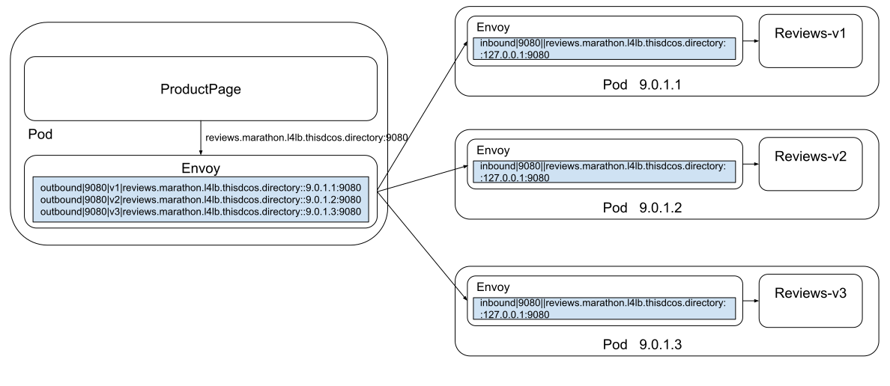

# Istio for Mesos(alpha)


This repo introduces how to run Istio on DC/OS or Mesos + Marathon environments. I added a new service registry based on Marathon [event stream](https://mesosphere.github.io/marathon/docs/event-bus.html) to `pilot-discovery`, using [go-marathon](https://github.com/gambol99/go-marathon) as client. Istio components and Zipkin are running as Marathon applications, while workloads is running with a pilot-agent/envoy in the same Marathon Pod.

## Quick Start on DC/OS

1. Deploy the control-plane in DC/OS.

	The control-plane consists of `etcd, apiserver, istio-pilot and zipkin`. The apiserver is used only for providing [CustomResourceDefinitions](https://kubernetes.io/docs/concepts/extend-kubernetes/api-extension/custom-resources/#customresourcedefinitions) like `virtualservice`, `destinationrule`.

	You can deploy the control-plane in group using command-line.
	```
	curl -XPOST master.mesos:8080/v2/groups -d "@install/istio-basic-control-plane.json"
	```

2. Deploy the bookfinfo sample

	The [bookinfo](https://istio.io/docs/examples/bookinfo/) is a sample application composed of four separate microservices used to demonstrate various Istio features.

	```
	dcos marathon pod add bookinfo/details.json
	dcos marathon pod add bookinfo/ratings.json
	dcos marathon pod add bookinfo/reviews-v1.json
	dcos marathon pod add bookinfo/reviews-v2.json
	dcos marathon pod add bookinfo/reviews-v3.json
	dcos marathon pod add bookinfo/productpage.json
	```

	After the services are running, you should be able to access `productpage`:
	```
	curl productpage.marathon.l4lb.thisdcos.directory:9080
	```

3. Deploy ingress-gateway
	Now all the bookinfo services are running in private nodes, we have to deploy a `ingress-gateway` in the public node to expose them.
```
	dcos marathon pod add install/ingressgateway.json
```

4. Apply gateway rules and expose productpage

	In the master or any agent node, setup kubectl first:
	```
	curl -LO https://storage.googleapis.com/kubernetes-release/release/v1.10.12/bin/linux/amd64/kubectl && export PATH=$PATH:$PWD && chmod +x kubectl
	kubectl config set-context istio --cluster=istio
	kubectl config set-cluster istio --server=http://apiserver.istio.marathon.slave.mesos:31080
	kubectl config use-context istio
	```
	Before we can use Istio to control the Bookinfo routing, we have to apply destination rules and gateway.
	```
	kubectl apply -f bookinfo/destination-rule-all.yaml
	kubectl apply -f bookinfo/gateway.yaml
	```

3. Visit the productpage and validate load-balancing by Envoy.

	Visit `$HOST_IP_OF_PRODUCTPAGE:$HOST_PORT_OF_PRODUCTPAGE`
	You can refresh the page and find Book Reviews has three kinds of version. This is because the envoy proxy of `productpage` pod will do round-roubin load-balance to one of the 3 `reviews` pods when there is NO routing rules applied.


5. Routing all traffics to v1
	```
	kubectl apply -f bookinfo/vs-all-v1.yaml
	```
	Now you can visit `productpage` again and find the `reviews` is always v1.

6. Fault inject: delaying requests to `details`
	```
	kubectl apply -f bookinfo/vs-delay-details.yaml
	```
	Now you can login as `jason` and found the page loading is slow...

	```
	# kubectl get virtualservice details
	apiVersion: networking.istio.io/v1alpha3
	kind: VirtualService
	metadata:
	  name: details
	spec:
	  hosts:
	  - details.marathon.l4lb.thisdcos.directory
	  http:
	  - match:
	    - headers:
	        end-user:
	          exact: jason
	    fault:
	      delay:
	        percent: 100
	        fixedDelay: 7s
	    route:
	    - destination:
	        host: details.marathon.l4lb.thisdcos.directory
	        subset: v1
	  - route:
	    - destination:
	        host: details.marathon.l4lb.thisdcos.directory
	        subset: v1
	```
	It inject 7s delay when routing to `details` service.

7. Fault inject: aborting rules
	```
	kubectl apply -f bookinfo/vs-details-abort.yaml
	```
	Refresh the `productpage` and visit `zipkin`. You can find tracing information that the return `status code` of `details` is `500`


## How to run Istio on Marathon/Mesos

WIP

## Code
https://github.com/harryge00/istio/tree/marathon-pilot/pilot/pkg/serviceregistry/mesos

## Development Guide

1. How does envoy redirect traffics?

	As you may know, DC/OS use `dcos-l4lb` to do loadbalancing. In a pod with envoy proxy, we do not need l4lb since envoy will load-balance traffics to Pods.
	
	In the example above, `productpage` is trying to access `reviews.marathon.l4lb.thisdcos.directory:9080`. The `productpage's` envoy has got IPs of the 3 different versions of `reviews` applications(because `Pilot-agent` will communicate with `Pilot-discovery` and got Pod's IP through cDS API and update envoy's config):
	```
	outbound|9080|v1|reviews.marathon.l4lb.thisdcos.directory::9.0.1.1:9080
	outbound|9080|v2|reviews.marathon.l4lb.thisdcos.directory::9.0.1.2:9080
	outbound|9080|v3|reviews.marathon.l4lb.thisdcos.directory::9.0.1.3:9080
	```
	So it will redirect traffics to one of the 3 IP:port, if no routing rules applied. After the upstream reviews Pod receives the traffics, it will check its inbound config and redirect traffics to corresponding listeners, which here is `127.0.0.1:9080`.

## TODO
